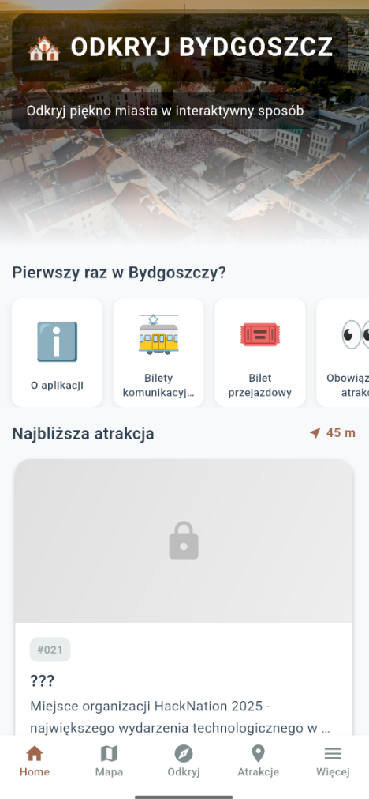

# HackNation2025 - Aplikacja Mobilna: Odkryj Bydgoszcz

**Autorzy:** Igor Simon, Aleksander Czarnecki, Jakub Glazik  
**Data:** Grudzień 2025  
**Framework:** Flutter (Multi-platform)

## O pomyśle 
Proponujemy stworzenie intuicyjnej aplikacji mobilnej w formie pamiętnika terenowego, która za pomocą geolokalizacji zamieni zwiedzanie Bydgoszczy w angażującą grę terenową, prowadząc turystów w każdym wieku do nieoczywistych i ukrytych zakątków miasta. Dzięki niezwykle prostemu interfejsowi użytkownicy bez trudu będą odkrywać unikalne treści historyczne dopiero po fizycznym dotarciu na miejsce. Co istotne, to cyfrowe zaangażowanie być może przełoży się na nagrody w świecie rzeczywistym, oferując system konkretnych zniżek i upominków realizowanych we współpracy z lokalnymi przedsiębiorcami i instytucjami kultury.

---

## Preview


## 🚀 Jak uruchomić aplikację
Najprościej uruchomić aplikację instalując na maszynie wirtualnej Android lub na własnym telefonie plik [OdkryjBydgoszcz.apk](OdkryjBydgoszcz.apk).

Jeśli chcesz zbudować kod samodzielnie, podążaj za poniższą instrukcją.

### Wymagania wstępne
- **Flutter SDK:** >= 3.7.2
- **Dart SDK:** >= 3.7.2
- **Android Studio**
- **Emulator/Symulator** lub fizyczne urządzenie z włączoną opcją deweloperską

### Instalacja

1. **Sklonuj repozytorium:**
   ```bash
   git clone https://github.com/iSimon55/HackNation2025IchTroje.git
   cd HackNation2025
   ```

2. **Zainstaluj zależności Flutter:**
   ```bash
   flutter pub get
   ```

### Uruchomienie aplikacji

#### Na Androidzie:
```bash
# Sprawdź dostępne urządzenia
flutter devices

# Uruchom aplikację
flutter run
```

#### Na iOS (tylko macOS):
```bash
# Zainstaluj pod dependencies (pierwsze uruchomienie)
cd ios
pod install
cd ..

# Uruchom aplikację
flutter run
```

#### Na emulatorze/symulatorze:
```bash
# Uruchom emulator Android
flutter emulators --launch <emulator_id>

# Lub otwórz symulator iOS (macOS)
open -a Simulator

# Następnie uruchom aplikację
flutter run
```

### Uprawnienia

Aplikacja wymaga następujących uprawnień:
- **Lokalizacja** - do obliczania odległości do atrakcji i weryfikacji pozycji użytkownika
- **Aparat** - do robienia zdjęć atrakcji (odblokowanie miejsca)
- **Galeria** - do wybierania zdjęć z galerii
- **Internet** - do otwierania linków zewnętrznych w przeglądarce

### Budowanie wersji produkcyjnej

#### Android APK:
```bash
flutter build apk --release
```

#### Android App Bundle (do Google Play):
```bash
flutter build appbundle --release
```

#### iOS:
```bash
flutter build ios --release
```

---

## 📦 Zainstalowane pakiety

- `image_picker: ^1.0.7` - Wybieranie i robienie zdjęć
- `shared_preferences: ^2.2.2` - Lokalne przechowywanie danych
- `geolocator: ^10.1.0` - Usługi lokalizacji
- `url_launcher: ^6.2.2` - Otwieranie URL w przeglądarce
- `flutter_map: ^6.1.0` - Interaktywne mapy
- `latlong2: ^0.9.0` - Praca z współrzędnymi geograficznymi


## 🎯 Wizja Projektu

### Koncepcja
Aplikacja mobilna łącząca nowoczesną nawigację z bogatą historią i unikalną architekturą Bydgoszczy. Projekt kładzie nacisk na industrialne dziedzictwo miasta (Młyny Rothera, Kanał Bydgoski) oraz secesyjną estetykę Starego Miasta.

### Kluczowe Lokalizacje
- **Kanał Bydgoski** - wodna arteria miasta
- **Wyspa Młyńska** - historyczne centrum przemysłowe
- **Opera Nova** - nowoczesna architektura nad wodą
- **Młyny Rothera** - industrialne dziedzictwo
- **Stare Miasto** - secesyjna architektura

---

## 👥 Grupa Docelowa

### Turyści (70%)
- **Wiek:** 25-55 lat
- **Potrzeby:** 
  - Gotowe trasy tematyczne
  - Łatwa nawigacja
  - Audioprzewodniki
  - Informacje praktyczne (godziny, ceny)
- **Zachowania:** Planują wizytę 1-3 dni wcześniej, szukają "must-see" i autentycznych doświadczeń

### Mieszkańcy (30%)
- **Wiek:** 20-60 lat
- **Potrzeby:**
  - Ukryte miejsca i ciekawostki
  - Bieżące wydarzenia
  - Szybki dostęp do informacji
- **Zachowania:** Spontaniczne użycie, poszukiwanie lokalnych wydarzeń weekendowych
